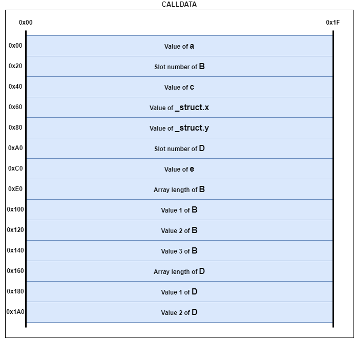

# Yul, Assembly and Bytecode

Yul does handle only bytes32 types. So, a variable that is not 32-bytes long is used, then the developer must be careful.

See the amazing Udemy course given by Jeffrey Scholz: "Advanced Solidity: Understanding and Optimizing Gas Costs".

## EVM basics
*Note: The EVM does use a lot of mechanisms and concepts that are widely used in computer science. If you already study how a process work (its memory layout for example), then you will not be lost here. When available, an equivalent in basic computer science will be given.*

The Ethereum Virtual Machine (EVM) is used on EVM-based blockchains to execute smart contracts.

EVM does use several data regions.

Sources: 
- https://www.evm.codes/about?fork=merge
- https://ethereum.github.io/yellowpaper/paper.pdf

### Data Region - The Code
*Note: basic computer equivalent = .CODE/.TEXT segment*

In the Code region, the instructions of the smart contracts are defined. Almost all of those instructions are taking their parameters from another data region: the Stack.

EVM does use its own instructions, which are defined here: https://www.evm.codes/


### Data Region - The Program Counter
*Note: basic computer equivalent = EIP register*

The Program Counter is used to encode which instruction should be next executed. It points to the code section.


### Data Region - The Stack
*Note: basic computer equivalent = stack segment*

In EVM, the stack is a list of 32-byte element. Each call has its own stack, which is destroyed when the call context ends.

The stack does follow a LIFO structure (Last-In First Out).


### Data Region - The Memory
*Note: basic computer equivalent = heap segment*

The memory region is not persistent, it is also destroyed at the end of the call context.

Memory is accessible using `MSTORE` and `MLOAD` instructions.

### Data Region - The storage
*Note: basic computer equivalent = data segment, but always persistent for each execution of contract*

This is a map of $2^{256}$ slots of 32-byte values. It is the persistent memory of contracts.

Storage is accessible using `SSTORE` and `SLOAD` instructions.

### Data Region - The calldata
*Note: basic computer equivalent = argc/argv, but instead of commandline, it is transaction*

This is the data sent to a smart contract through a transaction. The function selector will be in this calldata.

This calldata is accessible using `CALLDATALOAD`, `CALLDATASIZE` and `CALLDATACOPY`.

### Data Region - The return data
*Note: basic computer equivalent = return value*

This is the data returned from a smart contract once execution is done.

A contract access to it using `RETURN` or `REVERT` instructions. It can be read from a calling contract through `RETURNDATASIZE` and `RETURNDATACOPY`.

## Yul Code
### Local variable

Writing local memory variable:
```solidity
    function getNumber() external pure returns (uint256) {
        uint256 x;

        assembly {
            x := 42
        }

        return x;
    }
```


### Storage
#### Fixed variable
Reading storage value:
```solidity
    function getVarYul(uint256 slot) external view returns (bytes32 ret) {
        assembly {
            ret := sload(slot)
        }
    }
```


Writing storage value:
```solidity
    function setVarYul(uint256 slot, uint256 value) external {
        assembly {
            sstore(slot, value)
        }
    }
```

Get variable slot value:
```solidity
    function getSlotYul() external pure returns (uint256 retSlot) {
        assembly {
            retSlot := a.slot
        }
    }
```

Get variable offset value (in a slot, could be a uint16 for example):
```solidity
    function getOffsetE() external pure returns (uint256 slot, uint256 offset) {
        assembly {
            slot := E.slot
            offset := E.offset
        }
    }
```

Read variable value that is not 256 bits-long (example with a uint16):
```solidity
    function readE() external view returns (uint256 e) {
        assembly {
            let value := sload(E.slot) // must load in 32 byte increments
            //
            // E.offset = 28
            let shifted := shr(mul(E.offset, 8), value)
            // 0x0000000000000000000000000000000000000000000000000000000000010008
            // equivalent to
            // 0x000000000000000000000000000000000000000000000000000000000000ffff
            e := and(0xffff, shifted)
        }
    }
```


Write variable value that is not 256 bits-long (example with a uint16):
```solidity
    // masks can be hardcoded because variable storage slot and offsets are fixed
    // V and 00 = 00
    // V and FF = V
    // V or  00 = V
    // function arguments are always 32 bytes long under the hood
    function writeToE(uint16 newE) external {
        assembly {
            // newE = 0x000000000000000000000000000000000000000000000000000000000000000a
            let c := sload(E.slot) // slot 0
            // c = 0x0000010800000000000000000000000600000000000000000000000000000004
            let clearedE := and(
                c,
                0xffff0000ffffffffffffffffffffffffffffffffffffffffffffffffffffffff
            )
            // mask     = 0xffff0000ffffffffffffffffffffffffffffffffffffffffffffffffffffffff
            // c        = 0x0001000800000000000000000000000600000000000000000000000000000004
            // clearedE = 0x0001000000000000000000000000000600000000000000000000000000000004
            let shiftedNewE := shl(mul(E.offset, 8), newE)
            // shiftedNewE = 0x0000000a00000000000000000000000000000000000000000000000000000000
            let newVal := or(shiftedNewE, clearedE)
            // shiftedNewE = 0x0000000a00000000000000000000000000000000000000000000000000000000
            // clearedE    = 0x0001000000000000000000000000000600000000000000000000000000000004
            // newVal      = 0x0001000a00000000000000000000000600000000000000000000000000000004
            sstore(C.slot, newVal)
        }
    }
```

#### Arrays and Mappings
An array with fix length will be stored like a Fixed variable (see previous part).

Dynamic arrays and mappings use something else. 

For dynamic arrays, only one slot is used like fixed variable. This slot will keep the dynamic size of the array, and so will be decrease on pop, increase on push. Then, data will be stored at slot number `keccak256(array.slot)`, with `array.slot` the fixed variable slot previously defined. Then, all the dynamic values will be stored after this slot number. As uint256 is a really big number, collision in storage is pretty unlikely to happen.

Got storage slot of an index in a dynamic array:
```solidity
    function bigArrayLength() external view returns (uint256 ret) {
        assembly {
            ret := sload(bigArray.slot)
        }
    }

    function readBigArrayLocation(uint256 index)
        external
        view
        returns (uint256 ret)
    {
        uint256 slot;
        assembly {
            slot := bigArray.slot
        }
        bytes32 location = keccak256(abi.encode(slot));

        assembly {
            ret := sload(add(location, index))
        }
    }
```

A mapping will also be dynamic. Like dynamic arrays, it has one fixed storage slot. It will store value mapped to `key` at slot number `keccak(abi.encode(key, mapping.slot))`


### Memory
Memory is needed to do the followings:
- Return values to external calls
- Set the function arguments to external calls
- Get values from external calls
- Revert with an error string
- Log messages
- Create other smart contracts
- Use the keccak256 hash function

Memory is equivalent to the heap in other languages, but `free` is not possible (garbage collector) and 32 byte sequences are used.
It has only four instructions:
- `mload(p)`: retrieves 32 bytes from slot `p` 
- `mstore(p, v)`: stores `v` value in slot `p` (so if p = 0x10, it will end at)
- `mstore8(p, v)`: mstore with 1 byte
- `msize`: largest accessed memory index in that transaction

:warning: Pure Yul programs = Memory easy to use // Mixed Yul/Solidity programs = Solidity expects memory to be used in a specific manner :warning:

#### Solidity usage
Solidity does allocate:
- Slots [0x00-0x20], [0x20-0x40] for "scratch space"
- Slot [0x40-0x60] as the "free memory pointer"
- Slot [0x60-0x80] is kept empty
Then slots after 0x80 can be used.


#### Yul code examples

Return multiple values from memory:
```solidity
    function return2and4() external pure returns (uint256, uint256) {
        assembly {
            mstore(0x00, 2)
            mstore(0x20, 4)
            return(0x00, 0x40)
        }
    }
```
*Note: return here is a function in Yul, and not a keyword*

Require equivalent:
```solidity
    function requireV1() external view {
        require(msg.sender == 0xAb8483F64d9C6d1EcF9b849Ae677dD3315835cb2);
    }

    function requireV2() external view {
        assembly {
            if iszero(
                eq(caller(), 0xAb8483F64d9C6d1EcF9b849Ae677dD3315835cb2)
            ) {
                revert(0, 0)
            }
        }
    }
```

Hashing multiple values:
```solidity
    function hashV1() external pure returns (bytes32) {
        bytes memory toBeHashed = abi.encode(1, 2, 3);
        return keccak256(toBeHashed);
    }

    function hashV2() external pure returns (bytes32) {
        assembly {
            let freeMemoryPointer := mload(0x40)

            // store 1, 2, 3 in memory
            mstore(freeMemoryPointer, 1)
            mstore(add(freeMemoryPointer, 0x20), 2)
            mstore(add(freeMemoryPointer, 0x40), 3)

            // update memory pointer
            mstore(0x40, add(freeMemoryPointer, 0x60)) // increase memory pointer by 96 bytes

            mstore(0x00, keccak256(freeMemoryPointer, 0x60))
            return(0x00, 0x60)
        }
    }
```

Loggging and events:
```solidity
    function emitLog() external {
        emit SomeLog(5, 6);
    }

    function yulEmitLog() external {
        assembly {
            // keccak256("SomeLog(uint256,uint256)") --> Event signature
            let
                signature
            := 0xc200138117cf199dd335a2c6079a6e1be01e6592b6a76d4b5fc31b169df819cc
            log3(0, 0, signature, 5, 6)
        }
    }

    function v2EmitLog() external {
        emit SomeLogV2(5, true);
    }

    function v2YulEmitLog() external {
        assembly {
            // keccak256("SomeLogV2(uint256,bool)")
            let
                signature
            := 0x113cea0e4d6903d772af04edb841b17a164bff0f0d88609aedd1c4ac9b0c15c2
            mstore(0x00, 1)
            log2(0, 0x20, signature, 5)
        }
    }
```
*Note: indexed keyword allows to search for the event using the indexed parameters as filters.*


### Calling other contracts
Solidity standard says that a function selector is used for each function. In fact, on a contract call, this function selector will be passed as argument, a piece of code of the contract does execute the right function.

There are several ways to call other contracts:
- `call`: This is the basic call, it does call another contract function.
- `staticcall`: It does the same than call, but does not change the state of the blockchain. Used with view functions.
- `delegatecall`: This calls another contract's code, with the storage of the actual contract

If we do not know what the returned data size is, it is possible to use the `returndatasize` function to allocate the proper amount of memory, and then use the `returndatacopy` function to copy the returned data to the allocated memory.


#### Dynamic length arguments in calldata
The explanation will be given through an example, to make it easier to understand.

So, this function will be used:

```solidity
    struct structTest {
        uint256 x;
        uint256 y;
    }

    function test(
        uint256 a,
        uint256[] calldata b,
        uint256 c,
        structTest calldata _struct,
        uint256[] calldata d,
        uint256 e
    ) external {}
```

The following arguments will be passed:
- a = 1
- b = [10,20,30]
- c = 2
- _struct = structTest{ x = 8, y = 9 }
- d = [100,200]
- e = 3

Lets look at the calldata layout for the arguments:
```
0x7b1fd2c                                                           //  The function selector
0000000000000000000000000000000000000000000000000000000000000001    //  00: value of a
00000000000000000000000000000000000000000000000000000000000000e0    //  20: the calldata slot in which b is stored
0000000000000000000000000000000000000000000000000000000000000002    //  40: value of c
0000000000000000000000000000000000000000000000000000000000000008    //  60: value of x of structure _struct
0000000000000000000000000000000000000000000000000000000000000009    //  80: value of y of structure _struct
0000000000000000000000000000000000000000000000000000000000000160    //  A0: the calldata slot in which d is stored
0000000000000000000000000000000000000000000000000000000000000003    //  C0: the value of e
0000000000000000000000000000000000000000000000000000000000000003    //  E0: the length of the dynamic array b
000000000000000000000000000000000000000000000000000000000000000a    // 100: the first value of b
0000000000000000000000000000000000000000000000000000000000000014    // 120: the second value of b
000000000000000000000000000000000000000000000000000000000000001e    // 140: the third value of b
0000000000000000000000000000000000000000000000000000000000000002    // 160: the length of the dynamic array d
0000000000000000000000000000000000000000000000000000000000000064    // 180: the first value of d
00000000000000000000000000000000000000000000000000000000000000c8    // 1A0: the second value of d
```



#### Transfer of value
Two functions in Solidity:
- `call`: allows to specify the amount of gas or send all gas
- `transfer`: only 2300 gas with the call, it can throws error
- `send`: only 2300 gas with the call, returns a boolean


#### Function selector in pure Yul
Here is an example of contract selector in pure Yul:
```solidity
contract CalldataDemo {
    fallback() external {
        assembly {
            let cd := calldataload(0) // always loads 32 bytes
            // d2178b0800000000000000000000000000000000000000000000000000000000
            let selector := shr(0xe0, cd) // shift right 224 bits to get last 4 bytes
            // 00000000000000000000000000000000000000000000000000000000d2178b08

            // unlike other languages, switch does not "fall through"
            switch selector
            case 0xd2178b08 /* get2() */
            {
                returnUint(2)
            }
            case 0xba88df04 /* get99(uint256) */
            {
                returnUint(getNotSoSecretValue())
            }
            default {
                revert(0, 0)
            }

            function getNotSoSecretValue() -> r {
                if lt(calldatasize(), 36) {
                    revert(0, 0)
                }

                let arg1 := calldataload(4)
                if eq(arg1, 8) {
                    r := 88
                    leave
                }
                r := 99
            }

            function returnUint(v) {
                mstore(0, v)
                return(0, 0x20)
            }
        }
    }
}
```


### Pure Yul examples


#### Simple contract
```
object "test" {
    code {
        // constructor
        datacopy(0, dataoffset("runtime"), datasize("runtime"))
        return(0, datasize("runtime"))
        // end of constructor
    }

    object "runtime" {
        // runtime code, will be executed when contract is called
        code {
            mstore(0x00, 42)
            return(0x00, 0x20)
        }
    }
}
```

#### ERC20 Yul implementation

https://docs.soliditylang.org/en/v0.8.19/yul.html#complete-erc20-example

